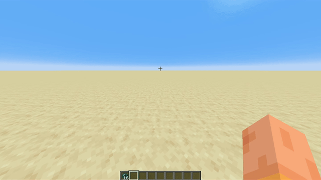

# click-pearl



Fabric клиент-сайд мод для Minecraft, который позволяет кидать эндер-перлы одной кнопкой - без ручного переключения слота.

## Возможности

- Мгновенный бросок перла по кнопке без смены выбранного предмета в руке
- Без визуальных глитчей - смена слота и возврат происходят за один тик
- Безопасно для античитов - отправляет корректные серверные пакеты (`ServerboundSetCarriedItemPacket` + `ServerboundUseItemPacket`) в правильном порядке
- Настраиваемый кейбинд - переназначается в стандартных настройках управления (по умолчанию: СКМ / Middle Mouse Button)
- Разрешение конфликтов - автоматически подавляет конфликтующие действия (например, vanilla Pick Block) на той же кнопке
- Поддержка offhand - перлы в левой руке тоже работают

## Установка

### 1. Требования

- Minecraft `1.21.4`
- [Fabric Loader](https://fabricmc.net/use/installer/)
- [Fabric API](https://modrinth.com/mod/fabric-api)

### 2. Скачай мод

Готовую сборку можно взять на [Modrinth](https://modrinth.com/user/KrejziBro).

### 3. Собери из исходников

```bash
git clone https://github.com/KreziBro/click-pearl
cd click-pearl
./gradlew build
```

Готовый `.jar` будет в папке `build/libs/`. Скопируй его в папку `mods/` своего Minecraft.

## Стек

- [Fabric](https://fabricmc.net/) - мод-загрузчик
- [Fabric API](https://modrinth.com/mod/fabric-api) - API для модов
- Java

